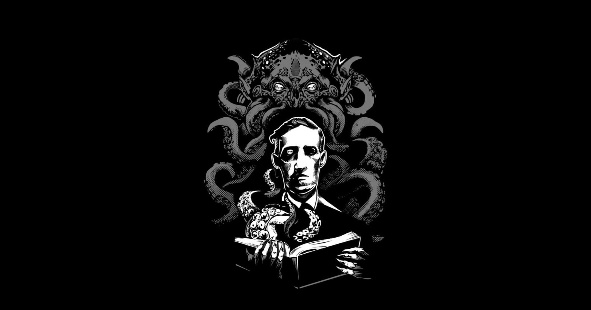
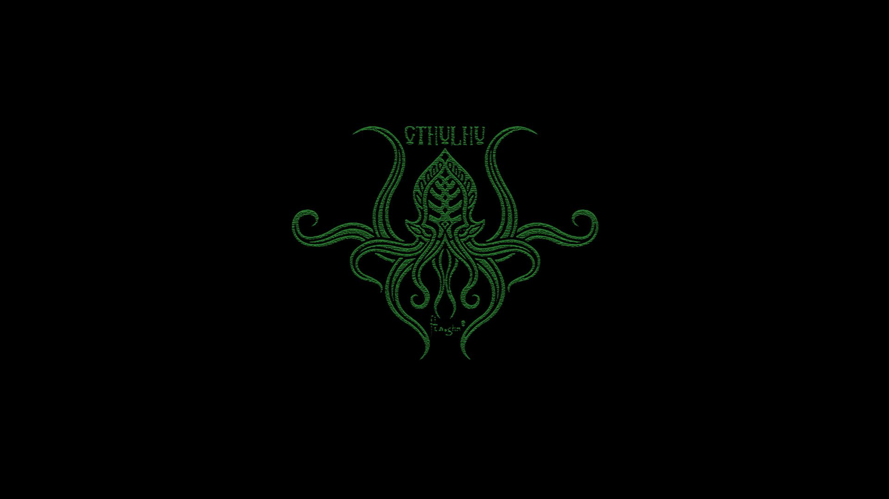
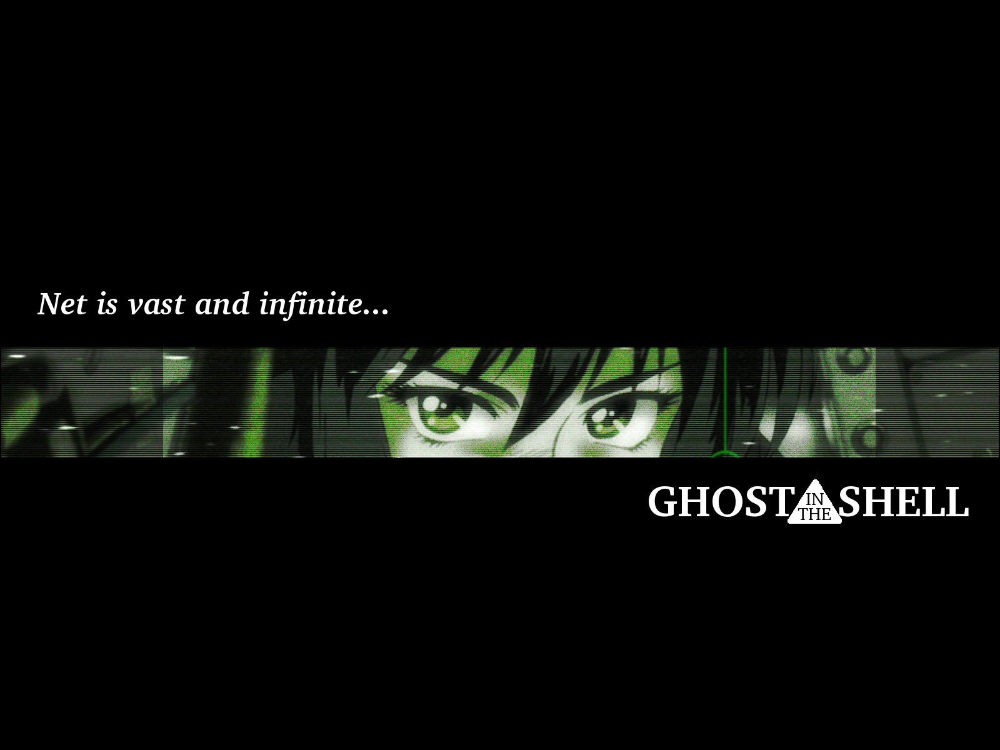
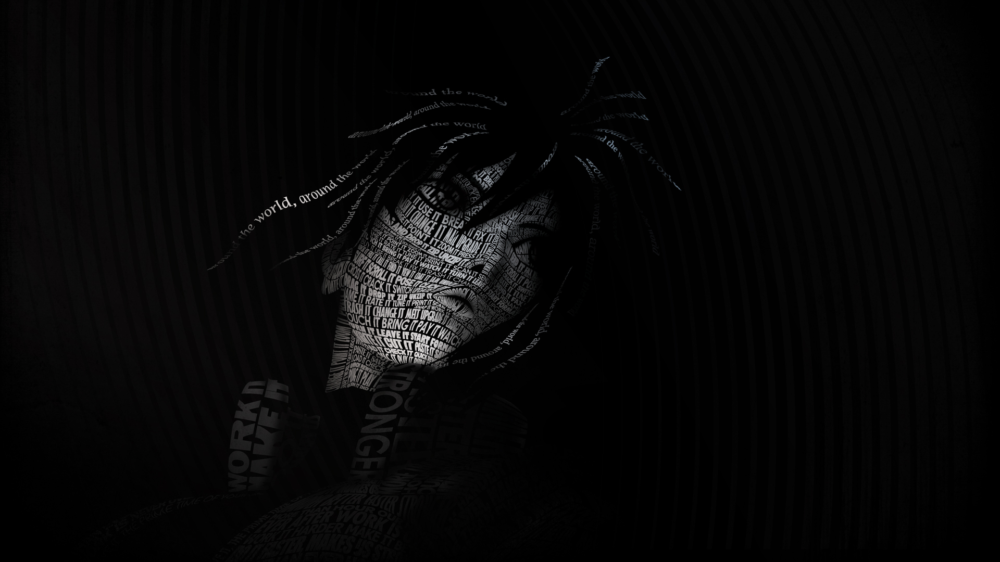
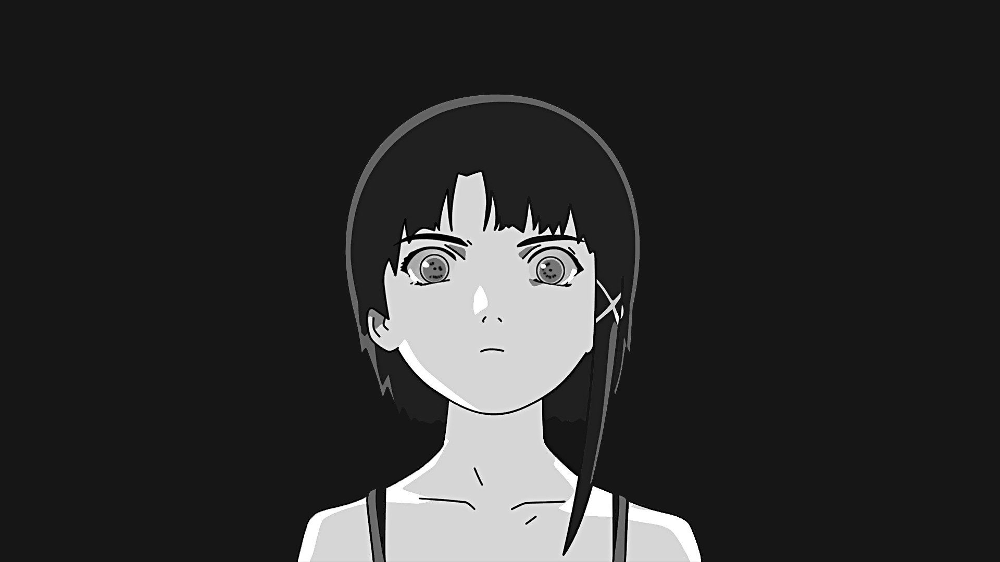

# BSPWM | Polybar themes collection with Theme Selector

Fork from [gh0stzk](https://github.com/gh0stzk/dotfiles) dotfiles adapted for Debian based systems.

## 🌿 Information
3 different themes for BSPWM, Polybar and ZSH Powerlevel10k. With a theme selector to change on the fly.

## :book: Wiki


## Info


|Distro|[Kali](https://www.kali.org/)| 
|:---:|:---:|
|WM|[BSPWM](https://github.com/baskerville/bspwm)|
|Bar|[Polybar](https://github.com/polybar/polybar)|
|Menu|[Rofi](https://github.com/davatorium/rofi)|
|Compositor|[Picom](https://archlinux.org/packages/community/x86_64/picom/)|
|Terminal|[Kitty](https://github.com/kovidgoyal/kitty)|
|Shell|[Zsh](https://archlinux.org/packages/extra/x86_64/zsh/) & [Powerlevel10k](https://github.com/romkatv/powerlevel10k/tree/master)|

<br>

## 🚀 Features


* **Change themes on the fly:** 3 different Rices now!.

* **Theme Selector:** <code>alt + space bar</code> to launch it.

* **Random wallpaper:**  Every time you switch between rices or reload bspwm with <code>super + alt + r</code> a new wallpaper is set depending on the rice you are on.

* **Wallpaper Changer** <code>super + alt + w</code> changes bethween different wallpapers in the actual rice.

**And more..**

## 🎨 The themes

### 🦑Cthulhu:

|||
|---|---|

<details>
<summary><b>Extra wallpapers in Cthulhu</b></summary>

|||||

</details>

### 👻Ghost

|||
|---|---|

<details>
<summary><b>Extra wallpapers in Ghost</b></summary>

|||||

</details>

### 👽Lain

|||
|---|---|

<details>
<summary><b>Extra wallpapers in Lain</b></summary>

|||||

</details>

## Very useful keybindigs to know...

- <code>alt + @space</code> Display menu to select theme selector.
- <code>super + shift + v</code> Open Visual Studio Code.
- <code>super + shift + f</code> Open Firefox.
- <code>super + shift + b</code> Open Burpsuite.
- <code>super + @space</code> Apps Menu.
- <code>super + h </code> Hides bar/s <code>super + u</code> unhide bar/s
- <code>super + Print</code> Takes screenshot.
- <code>ctrl + alt {plus,minus,t}</code> Changes transparency on focused window.
- <code>ctrl + super + alt + p</code> Power off computer. <code>ctrl + super + alt + r</code> Restart computer.
- <code>super + Return</code> Open a terminal.
- <code>super + Alt + Return</code> Open a floating terminal.
- <code>ctrl + super + alt + k</code> Brute Kill a window/process.
- <code>super + alt + w</code> Changes randomly wallpaper.
- <code>super + alt + r</code> Restart bspwm.

And more.. You need to look sxhkdrc file for more.

## 📦 setup

### 💾 Installation:
The installer only works for **Debian** Linux (I guess that Ubuntu could work as well).

<b>Open a terminal in HOME</b>
- **First download the installer**
```sh
git clone 
```
- **Now give it execute permissions**
```sh
cd dotfiles
```
- **Finally run the installer**
```sh
./installer.sh
```

## Credits
- [gh0stzk](https://github.com/gh0stzk/dotfiles)[turquoise-hexagon](https://github.com/turquoise-hexagon/fonts), [adi1090x](https://github.com/adi1090x/widgets), [gabrielzschmitz](https://github.com/gabrielzschmitz), [elenapan](https://github.com/elenapan/dotfiles), [rxyhn](https://github.com/rxyhn/bspdots), [okklol](https://github.com/okklol/eww-bar), [ikz87](https://github.com/ikz87).
